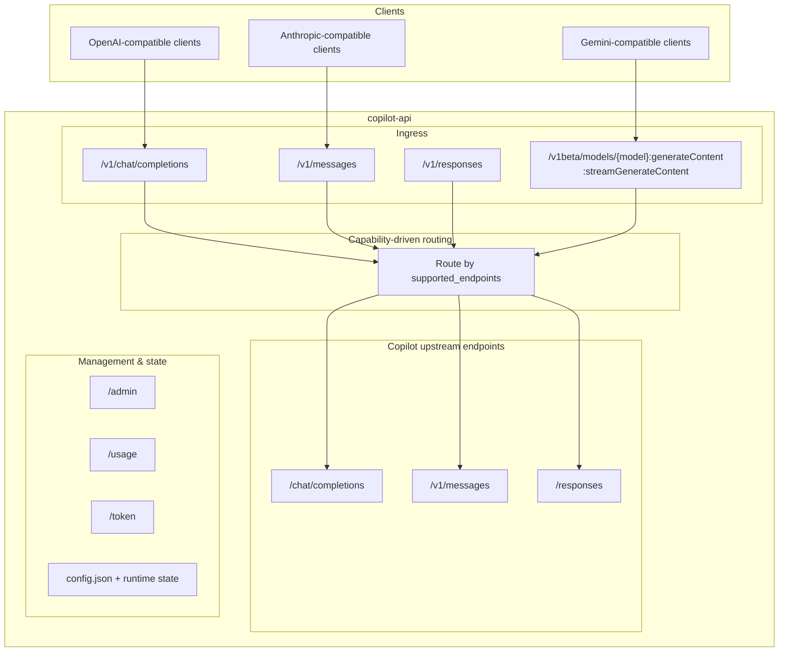

# Copilot API Proxy

**English | [中文](README.zh-CN.md)**

> [!NOTE]
> **About This Fork**
> This project is forked from [ericc-ch/copilot-api](https://github.com/ericc-ch/copilot-api). Since the original author has discontinued maintenance and no longer supports the new API, we have redesigned and rewritten it.
> Special thanks to [@ericc-ch](https://github.com/ericc-ch) for the original work and contribution!

> [!WARNING]
> This is a reverse-engineered proxy of GitHub Copilot API. It is not supported by GitHub, and may break unexpectedly. Use at your own risk.

> [!WARNING]
> **GitHub Security Notice:**  
> Excessive automated or scripted use of Copilot (including rapid or bulk requests, such as via automated tools) may trigger GitHub's abuse-detection systems.  
> You may receive a warning from GitHub Security, and further anomalous activity could result in temporary suspension of your Copilot access.
>
> GitHub prohibits use of their servers for excessive automated bulk activity or any activity that places undue burden on their infrastructure.
>
> Please review:
>
> - [GitHub Acceptable Use Policies](https://docs.github.com/site-policy/acceptable-use-policies/github-acceptable-use-policies#4-spam-and-inauthentic-activity-on-github)
> - [GitHub Copilot Terms](https://docs.github.com/site-policy/github-terms/github-terms-for-additional-products-and-features#github-copilot)
>
> Use this proxy responsibly to avoid account restrictions.

---

**Note:** If you are using [opencode](https://github.com/sst/opencode), you do not need this project. Opencode supports GitHub Copilot provider out of the box.

---

## Project Overview

A reverse-engineered proxy for the GitHub Copilot API that exposes OpenAI-compatible, Anthropic-compatible, and Gemini-compatible interfaces. The gateway routes by model `supported_endpoints` capabilities and performs protocol translation when needed, so clients using OpenAI Chat Completions, OpenAI Responses, Anthropic Messages, or Gemini generateContent-style calls can all work with the same backend (including [Claude Code](https://docs.anthropic.com/en/docs/claude-code/overview)).

## Architecture

The project currently works as a **capability-driven routing gateway**, not a single-path passthrough proxy:

1. It exposes OpenAI / Anthropic / Gemini-compatible ingress endpoints.
2. It selects upstream endpoint paths dynamically from model `supported_endpoints`.
3. Ingress protocol and final upstream protocol may differ (with bidirectional format translation).



## Request Flow (Current)

### /v1/messages (Anthropic ingress)
- If model supports messages -> use `/v1/messages`
- Else if model supports responses -> translate and use `/responses`
- Else -> translate and use `/chat/completions`

### /v1/chat/completions (OpenAI Chat ingress)
- If model supports chat -> use `/chat/completions`
- Else if model supports messages -> fallback to `/v1/messages`
- Else if model supports responses -> fallback to `/responses`
- If model declares `supported_endpoints` but none match -> return 400
- If endpoint metadata is missing/empty -> default to chat path

### /v1/responses (OpenAI Responses ingress)
- Allowed only when model supports responses
- If not supported -> direct 400 (no multi-endpoint fallback)

### /v1beta/models/{model}:generateContent / streamGenerateContent (Gemini-compatible ingress)
- Fixed chat-only design: always translate Gemini request to `/chat/completions`
- Execution order is: validate model capability first, then transform Gemini -> Chat payload
- If chat is not supported -> direct 400 (no messages/responses fallback)
- Currently text-input only via `contents.parts.text`


## Features

- **Multi-protocol ingress**: OpenAI Chat, OpenAI Responses, Anthropic Messages, and Gemini-compatible endpoints.
- **Capability-driven routing**: dynamically route by model `supported_endpoints`, without hardcoded model-name routing.
- **Bidirectional translation layer**: Anthropic <-> Chat, Anthropic <-> Responses, and Chat <-> Gemini-compatible translations.
- **Web account management**: add and manage multiple GitHub accounts from `/admin`.
- **Multi-account support**: switch active accounts without restarting the server.
- **Docker-first deployment**: container-focused deployment with persistent configuration.
- **Usage monitoring**: inspect usage and quota from `/usage`.
- **Rate-limit controls**: configurable throttling and wait strategy.
- **Account-type support**: individual / business / enterprise plans.
- **Trace correlation**: each inbound request carries an `x-trace-id` (accepted or generated), and the same ID is propagated upstream as `x-request-id` / `x-agent-task-id` for end-to-end diagnostics.

## Quick Start with Docker

### Using Docker Compose (Recommended)

```bash
# Start the server
docker compose up -d

# View logs
docker compose logs -f
```

Then visit **http://localhost:4141/admin**. On first run, you will be redirected to `/admin/setup` to create the Admin management secret. That setup route is localhost-only until a secret exists. After setup, sign in from `/admin/login` and add your GitHub account.

### Using Docker Run

```bash
docker run -d \
  --name copilot-api \
  -p 4141:4141 \
  -v copilot-data:/data \
  --restart unless-stopped \
  ghcr.io/qlhazycoder/copilot-api:latest
```

## Account Setup

1. Start the server using Docker
2. Open [http://localhost:4141/admin](http://localhost:4141/admin) in your browser
3. If this is the first run and no Admin secret is configured yet, complete the one-time setup at `/admin/setup` from localhost
4. Sign in from `/admin/login` with the Admin management secret
5. Click "Add Account" to start the GitHub OAuth device flow
6. Enter the code shown on GitHub's device authorization page
7. Your account will be automatically configured once authorized

The admin panel includes six tabs: `Accounts`, `Settings`, `Models`, `Usage`, `Model Mappings`, and `Manual`.

When no Admin secret exists yet, only localhost can access `/admin/setup`. After a secret is configured, non-localhost Admin access requires HTTPS.

## Admin UI Capabilities

### Accounts
- Add/switch/remove/reorder multiple GitHub accounts.
- The Accounts page refreshes account status and usage on a polling cycle (near real-time, not websocket push).
- Usage is fetched per account token.


### Models
- Grouped model display by provider.
- Visible/hidden filtering and visibility management mode.
- Double-click inline editing for premium multipliers (used in local usage-log accounting).
- Per-model reasoning effort configuration in Admin UI: options are shown only when a model declares supported reasoning levels; the proxy does not auto-inject reasoning fields when clients omit them.
- Model cards display feature tags and context window metadata.


### Usage
- Usage overview cards plus request log list.
- Logs are isolated by active account (no cross-account mixing).
- Supports local usage-log count modes:
  - `request`: log every request
  - `conversation`: dedupe only when the same conversation keeps the same `endpoint` + `model` + `multiplier`; if any of those fields changes, a new local log row is created and the local usage summary is refreshed again
- Adds a local `Quota Delta` column:
  - `max(lastPremiumUsed - firstPremiumUsed, 0) + multiplier`
  - The first request is counted by the row's multiplier, and later requests add the observed upstream premium-usage increment
- Supports `source` filtering (`all` / `request`) and cursor pagination; `endpoint` is currently display-only, not an independent filter.
- Configurable usage test/poll interval; default interval comes from config (default 10 minutes), and the test request uses `gpt-4o`.
- Monthly cleanup is lazy-on-write (cleanup runs when new logs are appended), not an exact cron trigger.
- This mode only affects local `usage_logs` behavior and summary-refresh strategy. It does not change the upstream Copilot billing data returned by `/usage`.


### Model Mappings
- Add, copy, and delete model mappings.
- Map client-facing aliases to actual Copilot models.
- Target model options can be loaded dynamically from `/v1/models`.


### Settings
- Edit global rate-limit and related admin settings (env vars still take precedence).
- Enable server-side automatic context compression and tune the user-facing trigger settings.
- Configure `anthropicApiKey` in the page for official Claude `/v1/messages/count_tokens` accuracy.
- View Admin security status, session lifetime, and the current management-secret source.
- Includes Usage test interval configuration.
- Includes a button to clear the current active account's local Usage log list. Historical month logs are also cleaned automatically on the first new write after the 1st of each month.


### Manual
- Includes an in-app compatibility table for `chat/completions`, `responses`, `messages`, and `gemini`.
- Summarizes the recommended endpoint grouping for tools such as GPT-Load or New API.
- Serves as the current quick reference for cross-project integration from the Admin UI.

## Environment Variables

| Variable | Default | Description |
|----------|---------|-------------|
| `PORT` | `4141` | Server port |
| `VERBOSE` | `false` | Enable verbose logging (also accepts `DEBUG=true`) |
| `RATE_LIMIT` | - | Minimum seconds between requests |
| `RATE_LIMIT_WAIT` | `false` | Wait instead of error when rate limit is hit |
| `SHOW_TOKEN` | `false` | Display tokens in logs |
| `PROXY_ENV` | `false` | Use `HTTP_PROXY`/`HTTPS_PROXY` from environment |
| `ADMIN_SECRET` | - | Plaintext Admin management secret used by `/admin/login`; recommended only through secure environment injection |
| `ADMIN_SECRET_HASH` | - | Pre-hashed Admin management secret; takes precedence over `ADMIN_SECRET` and web-saved config |

### Docker Compose Example with Options

```yaml
services:
  copilot-api:
    image: ghcr.io/qlhazycoder/copilot-api:latest
    container_name: copilot-api
    ports:
      - "4141:4141"
    volumes:
      - copilot-data:/data
    environment:
      - PORT=4141
      - VERBOSE=true
      - RATE_LIMIT=5
      - RATE_LIMIT_WAIT=true
    restart: unless-stopped

volumes:
  copilot-data:
```

If `RATE_LIMIT` / `RATE_LIMIT_WAIT` are not set via environment variables, you can configure them from the admin page's `Settings` tab. Environment variables take precedence over the saved web settings.

## API Endpoints

### OpenAI Compatible Endpoints

| Endpoint | Method | Description |
|----------|--------|-------------|
| `/v1/responses` | `POST` | OpenAI Responses API for model responses (available only for responses-capable models) |
| `/v1/chat/completions` | `POST` | Chat completions API (with capability-driven fallback) |
| `/v1/models` | `GET` | List available models |
| `/v1/embeddings` | `POST` | Create text embeddings |

Also available as compatibility aliases without `/v1`: `/chat/completions`, `/responses`, `/models`, `/embeddings`.

### Anthropic Compatible Endpoints

| Endpoint | Method | Description |
|----------|--------|-------------|
| `/v1/messages` | `POST` | Anthropic Messages API (with capability-driven fallback) |
| `/v1/messages/count_tokens` | `POST` | Token counting |

### Gemini Compatible Endpoints

| Endpoint | Method | Description |
|----------|--------|-------------|
| `/v1beta/models/{model}:generateContent` | `POST` | Gemini-compatible non-stream ingress, internally fixed to `/chat/completions` |
| `/v1beta/models/{model}:streamGenerateContent` | `POST` | Gemini-compatible stream ingress, internally fixed to `/chat/completions` and returned over SSE |

Note: Gemini ingress is currently chat-only and text-input focused (`contents.parts.text`); if the model does not support chat, it returns 400 directly.

### Management Endpoints

| Endpoint | Method | Description |
|----------|--------|-------------|
| `/admin` | `GET` | Account management Web UI (protected by Admin secret login; first-time setup uses localhost-only `/admin/setup`) |
| `/usage` | `GET` | Copilot usage statistics and quota |
| `/token` | `GET` | Current Copilot token |

## Tool Support

This project does not implement a full Claude Code / Codex tool protocol compatibility layer. Tool support is currently best-effort and limited to the tool shapes that GitHub Copilot accepts reliably.

- **Well-supported**: standard `function` tools passed through OpenAI-compatible or Anthropic-compatible requests.
- **Built-in Responses tools**: support exists for Copilot/OpenAI-style built-in tools such as `web_search`, `web_search_preview`, `file_search`, `code_interpreter`, `image_generation`, and `local_shell` when the upstream model/endpoint supports them.
- **Special compatibility**: custom `apply_patch` is normalized into a `function` tool for better compatibility.
- **Limited file editing compatibility**: common custom file-editing tool names such as `write`, `write_file`, `writefiles`, `edit`, `edit_file`, `multi_edit`, and `multiedit` are normalized into `function` tools so they are not dropped immediately by the proxy.
- **Not guaranteed**: skill-specific tools used by Claude Code, Codex, `superpowers`, or other agent frameworks may still fail if they depend on client-specific schemas, result formats, or tool execution semantics that Copilot does not support upstream.
- **Current limitation**: this proxy does not yet provide a complete end-to-end compatibility layer for all Claude Code or Codex file tools. If a skill depends on a proprietary tool contract, additional adapter work is still required.

## Using with Claude Code

Configure Claude Code to use this proxy by creating a `.claude/settings.json` file:

```json
{
  "env": {
    "ANTHROPIC_BASE_URL": "http://localhost:4141",
    "ANTHROPIC_AUTH_TOKEN": "sk-xxxx"
  },
  "model": "opus",
  "permissions": {
    "deny": ["WebSearch"]
  }
}
```

### Configure Model Mappings in the Admin UI

Model selection no longer needs to be hardcoded in `.claude/settings.json`. Open `/admin`, switch to the `Model Mappings` tab, and map Claude Code model aliases to the actual Copilot models you want to use.

This is the recommended way to route `haiku`, `sonnet`, `opus`, dated Claude model IDs, or any other client-facing model name without changing local Claude Code settings each time.


More options: [Claude Code settings](https://docs.anthropic.com/en/docs/claude-code/settings#environment-variables)

### Optional: install the copilot-api Claude Code plugin

If you want Claude Code to inject an extra marker during the `SubagentStart` hook so `copilot-api` can more reliably distinguish initiator overrides, you can install the optional plugin directly from this repository:

```bash
/plugin marketplace add https://github.com/QLHazyCoder/copilot-api.git
/plugin install copilot-api-subagent-marker@copilot-api-marketplace
```

This plugin is only a lightweight hook helper. It does not start or manage the `copilot-api` service itself, which should still be deployed separately via Docker as described above.

## Configuration (config.json)

The configuration file is stored at `/data/copilot-api/config.json` inside the container (persisted via Docker volume).

```json
{
  "accounts": [
    {
      "id": "12345",
      "login": "github-user",
      "avatarUrl": "https://...",
      "token": "gho_xxxx",
      "accountType": "individual",
      "createdAt": "2025-01-27T..."
    }
  ],
  "activeAccountId": "12345",
  "extraPrompts": {
    "gpt-5-mini": "<exploration prompt>"
  },
  "smallModel": "gpt-5-mini",
  "modelReasoningEfforts": {
    "gpt-5-mini": "xhigh"
  },
  "contextManagement": {
    "mode": "summarize_then_trim",
    "summarizeAtRatio": 0.8,
    "targetRatio": 0.55,
    "keepRecentTurns": 4,
    "summaryMaxTokens": 2048,
    "summarizerModel": "gpt-5-mini"
  },
  "anthropicApiKey": "sk-ant-..."
}
```

### Configuration Options

| Key | Description |
|-----|-------------|
| `accounts` | List of configured GitHub accounts |
| `activeAccountId` | Currently active account ID |
| `extraPrompts` | Per-model prompts appended to system messages |
| `smallModel` | Fallback model for warmup requests (default: `gpt-5-mini`) |
| `modelReasoningEfforts` | Admin-side stored reasoning effort preference (`none`, `minimal`, `low`, `medium`, `high`, `xhigh`); requests are not auto-patched when clients omit reasoning fields |
| `modelMapping` | Alias mapping rules (persisted from Admin `Model Mappings`) |
| `premiumModelMultipliers` | Premium accounting multipliers per model |
| `modelCardMetadata` | Extended model-card metadata (e.g. context window / features) |
| `hiddenModels` | Models hidden in the Admin UI |
| `useFunctionApplyPatch` | Whether `apply_patch` is normalized to a `function` tool (enabled by default) |
| `contextManagement` | Context-window strategy. Default `mode` is `trim`; `summarize_then_trim` summarizes older turns at `summarizeAtRatio` before falling back to old-turn trimming |
| `anthropicApiKey` | Optional Anthropic API key used for accurate Claude `/v1/messages/count_tokens` forwarding |
| `auth.apiKey` | Optional gateway API key; when configured, requests must include `x-api-key` or `Authorization: Bearer <key>` |
| `rateLimitSeconds` | Saved global minimum interval between requests when `RATE_LIMIT` env is not set |
| `rateLimitWait` | Saved wait behavior when rate limit is hit and `RATE_LIMIT_WAIT` env is not set |
| `usageTestIntervalMinutes` | Usage test/poll interval in minutes (can be `null`) |
| `usageLogCountMode` | Local usage-log count mode: `request` or `conversation` (`conversation` dedupes by conversation id + endpoint/model/multiplier) |

## Development

### Prerequisites

- Bun >= 1.2.x
- GitHub account with Copilot subscription

### Commands

```bash
# Install dependencies
bun install

# Start development server (with hot reload)
bun run dev

# Type checking
bun run typecheck

# Linting
bun run lint
bun run lint --fix

# Run tests
bun test

# Production build
bun run build

# Check for unused code
bun run knip
```

## Usage Tips

- **Rate Limiting**: Use `RATE_LIMIT` to prevent hitting GitHub's rate limits. Set `RATE_LIMIT_WAIT=true` to queue requests instead of returning errors.
- **Business/Enterprise Accounts**: The account type is automatically detected during OAuth flow.
- **Multiple Accounts**: Add multiple accounts via `/admin` and switch between them as needed.
- **Claude token counting**: `/v1/messages/count_tokens` tries Anthropic's official count endpoint first for Claude models when `anthropicApiKey` (or `ANTHROPIC_API_KEY`) is available, and falls back to local estimation on failure.
- **Trace headers**: You can pass `x-trace-id` from the client; if absent or invalid, the gateway auto-generates one and returns it in the response header, while forwarding the same ID upstream for request correlation.
- **Gateway API key auth**: when `auth.apiKey` is configured, protected routes require `x-api-key` or `Authorization: Bearer <key>`.

## Premium Interaction Notes

- **Premium interaction counts come from Copilot/GitHub, not from this proxy inventing its own billing model.** The `/usage` endpoint simply exposes the upstream Copilot usage data.
- **Skill, hook, plan, and subagent workflows may increase `premium_interactions`.** When a client uses features such as Claude Code subagents or `superpowers`, Copilot may treat the parent interaction and subagent interaction as separate billable interactions.
- **Warmup requests may also count upstream.** This project already tries to reduce the impact by routing some warmup-style requests to `smallModel`, but it cannot fully control how Copilot accounts for them.
- **This is not fully fixable at the proxy layer.** The proxy can normalize some message shapes to reduce accidental over-counting, but it cannot override Copilot's upstream interaction accounting.
- **If you see an increase while using subagents, that does not necessarily mean the proxy sent duplicate business requests.** In the normal request path, the proxy forwards a single upstream request per chosen endpoint, but Copilot may still count multiple interactions for the overall workflow.

## CLAUDE.md Recommended Content

Please include the following in `CLAUDE.md` (for Claude usage):

- Prohibited from directly asking questions to users, MUST use AskUserQuestion tool.
- Once you can confirm that the task is complete, MUST use AskUserQuestion tool to make user confirm. The user may respond with feedback if they are not satisfied with the result, which you can use to make improvements and try again.
