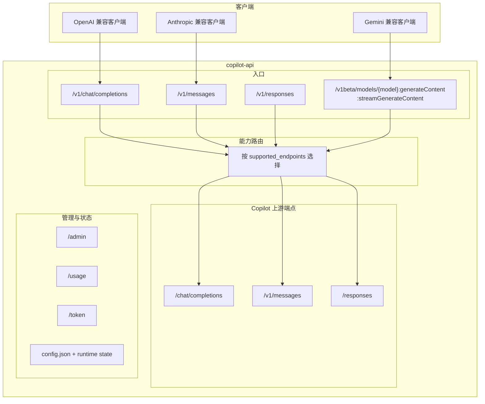
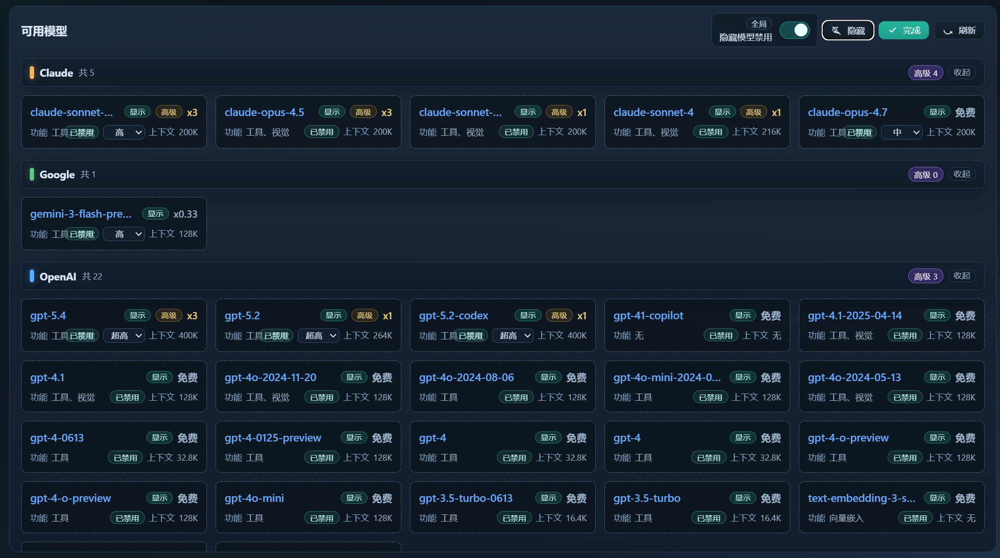
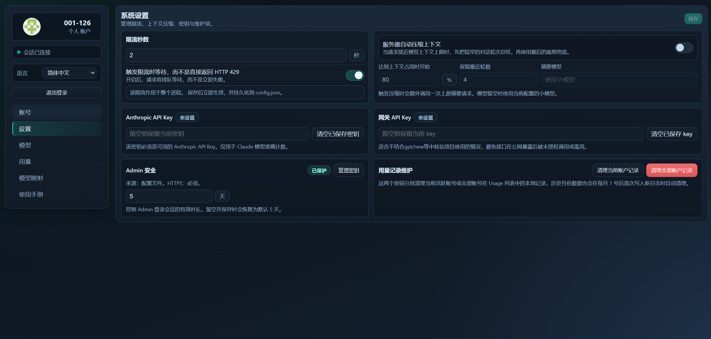

# Copilot API Proxy

**[English](README.md) | 中文**

> [!NOTE]
> **关于这个分支**
> 本项目 fork 自 [ericc-ch/copilot-api](https://github.com/ericc-ch/copilot-api)。
> 由于原项目已停止维护，且不再支持新的 API 形态，这个分支对整体能力做了重新设计和重写。
> 感谢 [@ericc-ch](https://github.com/ericc-ch) 的原始工作与贡献。

> [!WARNING]
> 这是一个非官方的 GitHub Copilot API 代理实现，不受 GitHub 官方支持，接口行为未来可能发生变化。

> [!WARNING]
> **GitHub 安全提示**
> 过度自动化、脚本化、批量化使用 Copilot，可能触发 GitHub 的滥用检测。
> 如出现异常使用模式，可能收到 GitHub 安全警告，严重时可能影响 Copilot 访问权限。
>
> 请参考：
>
> - [GitHub Acceptable Use Policies](https://docs.github.com/site-policy/acceptable-use-policies/github-acceptable-use-policies#4-spam-and-inauthentic-activity-on-github)
> - [GitHub Copilot Terms](https://docs.github.com/site-policy/github-terms/github-terms-for-additional-products-and-features#github-copilot)

---

**说明：**如果你在使用 [opencode](https://github.com/sst/opencode)，通常不需要这个项目；opencode 已内置 GitHub Copilot provider。

---

## 项目概览

这是一个将 GitHub Copilot 暴露为多协议接口的代理网关，支持：

- OpenAI Chat Completions
- OpenAI Responses
- Anthropic Messages
- Gemini generateContent 兼容接口

项目不会把所有请求固定转发到单一路径，而是根据模型的 `supported_endpoints` 能力动态选择上游端点，并在需要时做协议转换。因此，同一个后端可以同时服务多种客户端，包括 [Claude Code](https://docs.anthropic.com/en/docs/claude-code/overview)。

## 架构

当前项目更像一个“能力驱动的路由网关”，而不是简单的透传代理：

1. 对外提供 OpenAI / Anthropic / Gemini 兼容入口。
2. 对内根据模型能力动态决定上游请求走 `/chat/completions`、`/v1/messages` 还是 `/responses`。
3. 当入口协议和最终上游协议不一致时，由代理完成请求与响应格式转换。



## 当前请求流转

### `/v1/messages`

- 模型支持 `messages` 时，直接走 `/v1/messages`
- 否则如果支持 `responses`，转换后走 `/responses`
- 再否则，转换后走 `/chat/completions`

### `/v1/chat/completions`

- 模型支持 `chat` 时，直接走 `/chat/completions`
- 否则如果支持 `messages`，回退到 `/v1/messages`
- 否则如果支持 `responses`，回退到 `/responses`
- 如果模型声明了 `supported_endpoints` 但三者都不匹配，直接返回 `400`
- 如果端点元数据缺失或为空，默认按 `chat` 路径尝试

### `/v1/responses`

- 仅对支持 `responses` 的模型开放
- 不支持时直接返回 `400`

### `/v1beta/models/{model}:generateContent`

- 当前采用 chat-only 设计，Gemini 请求统一转换为 `/chat/completions`
- 先校验模型能力，再做 Gemini -> Chat 转换
- 模型不支持 `chat` 时直接返回 `400`
- 当前主要处理 `contents.parts.text`

## 功能特性

- 多协议入口：OpenAI Chat、OpenAI Responses、Anthropic Messages、Gemini 兼容接口
- 能力驱动路由：按模型 `supported_endpoints` 动态分流
- 双向转换：支持 Anthropic <-> Chat、Anthropic <-> Responses、Chat <-> Gemini 兼容转换
- Web 管理后台：通过 `/admin` 管理多个 GitHub 账号
- 多账号切换：无需重启即可切换当前激活账号
- Docker 优先部署：配置与数据可以通过 volume 持久化
- 用量查看：通过 `/usage` 查看 Copilot 用量和额度信息
- 速率限制：支持限流与等待策略
- 账号类型识别：支持个人 / Business / Enterprise
- Trace 透传：接受或生成 `x-trace-id`，并同步转发为上游 `x-request-id` / `x-agent-task-id`

## Docker 快速开始

### Docker Compose

```bash
docker compose up -d
docker compose logs -f
```

启动后访问 **http://localhost:4141/admin**。首次运行会先跳转到 `/admin/setup` 创建 Admin 管理密钥；在密钥尚未配置前，这个 setup 页面只允许从 localhost 访问。完成 setup 后，再从 `/admin/login` 登录并添加 GitHub 账号。

### Docker Run

```bash
docker run -d \
  --name copilot-api \
  -p 4141:4141 \
  -v copilot-data:/data \
  --restart unless-stopped \
  ghcr.io/qlhazycoder/copilot-api:latest
```

## 账号设置

1. 启动服务
2. 在浏览器打开 [http://localhost:4141/admin](http://localhost:4141/admin)
3. 如果还没有配置 Admin 管理密钥，请从 localhost 完成一次性 `/admin/setup`
4. 之后通过 `/admin/login` 使用该密钥登录
5. 点击“添加账号”启动 GitHub Device Flow
6. 在 GitHub 授权页输入显示的设备码
7. 授权完成后，账号会自动保存并可在后台切换

后台目前有六个标签页：`Accounts`、`Settings`、`Models`、`Usage`、`Model Mappings`、`Manual`。

补充说明：
未配置 Admin 密钥时，只有 localhost 可以访问 `/admin/setup`；密钥配置完成后，非 localhost 的 Admin 访问默认要求 HTTPS。

## Admin 页面能力

### Accounts

- 添加、切换、删除、拖拽排序多个 GitHub 账号
- 账号页按轮询刷新状态和用量
- 用量数据按账号隔离


### Models

- 按 provider 分组展示模型
- 支持可见 / 隐藏视图切换和管理模式
- 支持双击编辑 premium multiplier，用于本地 usage log 统计
- 支持按模型配置 reasoning effort，仅在模型声明支持时显示对应选项
- 模型卡片展示功能标签与上下文窗口信息




### Usage

- 展示用量概览卡片和请求日志
- 日志按当前激活账号隔离
- 支持两种本地 usage log 统计模式：
  - `request`：每次请求都记一条
  - `conversation`：同一会话在 `endpoint`、`model`、`multiplier` 都不变时才合并
- 增加本地 `Quota Delta` 列：
  - `max(lastPremiumUsed - firstPremiumUsed, 0) + multiplier`
- 支持 `source` 过滤与游标分页
- 支持配置用量测试轮询间隔，默认测试模型为 `gpt-4o`
- 月度清理是“写入时惰性清理”，不是固定 cron


### Model Mappings

- 添加、复制、删除模型映射
- 将客户端侧别名映射到真实 Copilot 模型
- 目标模型选项可从 `/v1/models` 动态加载


### Settings

- 编辑全局限流相关设置，环境变量优先级更高
- 配置服务端自动上下文压缩与触发阈值
- 配置 `anthropicApiKey`，提高 Claude `/v1/messages/count_tokens` 的官方计数准确性
- 查看 Admin 安全状态、会话有效期、管理密钥来源
- 配置 Usage 测试间隔
- 一键清理当前激活账号的本地 Usage 日志



### Manual

- 内置 `chat/completions`、`responses`、`messages`、`gemini` 的端点兼容表
- 提供 GPT-Load、New API 等项目的推荐分组方式
- 作为后台里的即时接入参考手册使用

## 环境变量

| 变量 | 默认值 | 说明 |
|------|--------|------|
| `PORT` | `4141` | 服务端口 |
| `VERBOSE` | `false` | 启用详细日志，也接受 `DEBUG=true` |
| `RATE_LIMIT` | - | 请求之间的最小秒数 |
| `RATE_LIMIT_WAIT` | `false` | 命中限流时等待而不是直接报错 |
| `SHOW_TOKEN` | `false` | 在日志中打印 token |
| `PROXY_ENV` | `false` | 从环境变量读取 `HTTP_PROXY` / `HTTPS_PROXY` |
| `ADMIN_SECRET` | - | 明文 Admin 管理密钥，用于 `/admin/login` |
| `ADMIN_SECRET_HASH` | - | 预先哈希后的 Admin 管理密钥，优先级高于 `ADMIN_SECRET` |

### Docker Compose 示例

```yaml
services:
  copilot-api:
    image: ghcr.io/qlhazycoder/copilot-api:latest
    container_name: copilot-api
    ports:
      - "4141:4141"
    volumes:
      - copilot-data:/data
    environment:
      - PORT=4141
      - VERBOSE=true
      - RATE_LIMIT=5
      - RATE_LIMIT_WAIT=true
    restart: unless-stopped

volumes:
  copilot-data:
```

如果没有通过环境变量配置 `RATE_LIMIT` / `RATE_LIMIT_WAIT`，也可以在后台 `Settings` 页面中保存；环境变量优先。

## API 端点

### OpenAI 兼容端点

| 端点 | 方法 | 说明 |
|------|------|------|
| `/v1/responses` | `POST` | OpenAI Responses，只有支持 `responses` 的模型可用 |
| `/v1/chat/completions` | `POST` | Chat Completions，带能力驱动 fallback |
| `/v1/models` | `GET` | 获取模型列表 |
| `/v1/embeddings` | `POST` | 创建 embedding |

同时也提供不带 `/v1` 前缀的兼容别名：`/chat/completions`、`/responses`、`/models`、`/embeddings`。

### Anthropic 兼容端点

| 端点 | 方法 | 说明 |
|------|------|------|
| `/v1/messages` | `POST` | Anthropic Messages，带能力驱动 fallback |
| `/v1/messages/count_tokens` | `POST` | Token 计数 |

### Gemini 兼容端点

| 端点 | 方法 | 说明 |
|------|------|------|
| `/v1beta/models/{model}:generateContent` | `POST` | Gemini 非流式兼容入口，内部固定转到 `/chat/completions` |
| `/v1beta/models/{model}:streamGenerateContent` | `POST` | Gemini 流式兼容入口，内部固定转到 `/chat/completions` 并通过 SSE 返回 |

说明：Gemini 入口当前是 chat-only 设计，主要处理 `contents.parts.text`。模型不支持 `chat` 时直接返回 `400`。

### 管理端点

| 端点 | 方法 | 说明 |
|------|------|------|
| `/admin` | `GET` | 管理后台；首次配置通过 localhost-only 的 `/admin/setup` 完成 |
| `/usage` | `GET` | Copilot 用量和额度信息 |
| `/token` | `GET` | 当前 Copilot token |

## 工具支持范围

这个项目并没有完整实现 Claude Code / Codex 的全套工具协议兼容层。目前是“尽量兼容 GitHub Copilot 能稳定接受的工具形态”。

- 明确支持：标准 `function` 工具
- Responses 内建工具：`web_search`、`web_search_preview`、`file_search`、`code_interpreter`、`image_generation`、`local_shell`
- 特殊兼容：`apply_patch` 会被规范化为 `function`
- 有限文件编辑兼容：`write`、`write_file`、`writefiles`、`edit`、`edit_file`、`multi_edit`、`multiedit` 等常见名称会被转换成 `function`
- 不保证兼容：依赖私有 schema、结果格式或客户端自定义执行语义的工具，仍可能失败

## 配合 Claude Code 使用

创建 `.claude/settings.json`：

```json
{
  "env": {
    "ANTHROPIC_BASE_URL": "http://localhost:4141",
    "ANTHROPIC_AUTH_TOKEN": "sk-xxxx"
  },
  "model": "opus",
  "permissions": {
    "deny": ["WebSearch"]
  }
}
```

### 在 Admin 页面配置模型映射

现在不必再把模型别名硬编码进 `.claude/settings.json`。打开 `/admin`，进入 `Model Mappings`，把 Claude Code 侧使用的别名映射到实际 Copilot 模型即可。

适合统一管理 `haiku`、`sonnet`、`opus`、带日期版本的 Claude 模型 ID，以及其他客户端自定义别名。


更多配置说明见：[Claude Code settings](https://docs.anthropic.com/en/docs/claude-code/settings#environment-variables)

### 可选：安装 copilot-api 的 Claude Code 插件

如果你希望在 `SubagentStart` hook 中注入一个额外 marker，帮助 `copilot-api` 更稳定地区分 initiator override，可以安装这个可选插件：

```bash
/plugin marketplace add https://github.com/QLHazyCoder/copilot-api.git
/plugin install copilot-api-subagent-marker@copilot-api-marketplace
```

这个插件只是轻量 hook 辅助层，不负责启动或管理 `copilot-api` 服务本身。

## 配置文件（config.json）

容器内路径为 `/data/copilot-api/config.json`，通过 Docker volume 持久化。

```json
{
  "accounts": [
    {
      "id": "12345",
      "login": "github-user",
      "avatarUrl": "https://...",
      "token": "gho_xxxx",
      "accountType": "individual",
      "createdAt": "2025-01-27T..."
    }
  ],
  "activeAccountId": "12345",
  "extraPrompts": {
    "gpt-5-mini": "<exploration prompt>"
  },
  "smallModel": "gpt-5-mini",
  "modelReasoningEfforts": {
    "gpt-5-mini": "xhigh"
  },
  "contextManagement": {
    "mode": "summarize_then_trim",
    "summarizeAtRatio": 0.8,
    "targetRatio": 0.55,
    "keepRecentTurns": 4,
    "summaryMaxTokens": 2048,
    "summarizerModel": "gpt-5-mini"
  },
  "anthropicApiKey": "sk-ant-..."
}
```

### 关键配置项

| 键 | 说明 |
|----|------|
| `accounts` | 已配置的 GitHub 账号列表 |
| `activeAccountId` | 当前激活账号 ID |
| `extraPrompts` | 每个模型附加的 system prompt |
| `smallModel` | 预热请求的备用模型，默认 `gpt-5-mini` |
| `modelReasoningEfforts` | 后台保存的每模型 reasoning effort 偏好 |
| `modelMapping` | 模型别名映射 |
| `premiumModelMultipliers` | Premium 统计倍率配置 |
| `modelCardMetadata` | 模型卡片扩展元数据，如 context window、features |
| `hiddenModels` | 在后台隐藏的模型列表 |
| `useFunctionApplyPatch` | 是否把 `apply_patch` 规范化为 `function` |
| `contextManagement` | 上下文窗口策略，支持 `trim` 与 `summarize_then_trim` |
| `anthropicApiKey` | 用于 Claude `/v1/messages/count_tokens` 官方计数 |
| `auth.apiKey` | 网关 API key，启用后需要通过 `x-api-key` 或 `Authorization` 传入 |
| `rateLimitSeconds` | 当未设置 `RATE_LIMIT` 时使用的后台保存限流值 |
| `rateLimitWait` | 当未设置 `RATE_LIMIT_WAIT` 时使用的后台保存等待策略 |
| `usageTestIntervalMinutes` | `/usage` 页面测试轮询间隔，允许为 `null` |
| `usageLogCountMode` | 本地 usage log 模式：`request` 或 `conversation` |

## 开发

### 前置要求

- Bun >= 1.2.x
- 有 Copilot 订阅的 GitHub 账号

### 常用命令

```bash
bun install
bun run dev
bun run typecheck
bun run lint
bun run lint --fix
bun test
bun run build
bun run knip
```

## 使用建议

- 使用 `RATE_LIMIT` 和 `RATE_LIMIT_WAIT=true` 控制请求速率
- Business / Enterprise 账号类型会在 OAuth 流程中自动识别
- 可通过 `/admin` 维护多个账号并随时切换
- 为 Claude 计数准确性配置 `anthropicApiKey`
- 客户端可主动传入 `x-trace-id`，也可由网关自动生成
- 当配置 `auth.apiKey` 后，受保护路由需要 `x-api-key` 或 `Authorization: Bearer <key>`

## Premium Interaction 说明

- `premium_interactions` 来自 Copilot / GitHub 上游计量，不是本项目自行发明的计费模型
- Skill、hook、plan、subagent 等工作流可能带来更多 `premium_interactions`
- 预热请求也可能被上游计入使用量
- 代理层可以减少部分误计数，但无法改变上游最终计量方式

## CLAUDE.md 推荐内容

如果你用 Claude Code，可以在 `CLAUDE.md` 中加入项目自己的工作约束，例如：

- 不直接向用户提问，统一通过指定交互工具提问
- 确认任务完成后，再通过指定交互工具让用户确认结果
